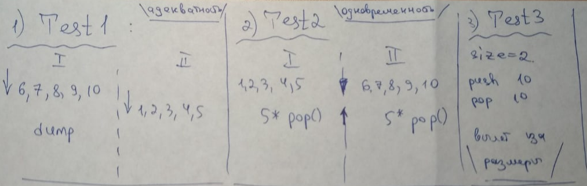

# Stack #
### Shared memory ###
In the main there are 3 tests

##### TEST1: ##### 
В двух процессах по очерёдно кидаются данные и после каждой вставки срабатывается функция dump().
Интересное: так как мы храним void*, то видно, что так как для одинаковых процессов int data[] определяется в одном месте, то с разных процессов одновременно читаются одни и те же данные по-разному, как

1, 2, 3, 4, 5, 1, 2, 3, 4, 5   - для процесса с int data[] = {1, 2, 3, 4, 5}

6, 7, 8, 9, 10, 6, 7, 8, 9, 10 - для процесса с int data[] = {6, 7, 8, 9, 10}

Ещё раз убедились в том, что мы работаем с виртуальной памятью
##### TEST2: ##### 
Теперь процессы одновременно кидаются в стэк и проверяется очередность, работа правильная с критической зоной (обеспечивается семафорами)
##### TEST3: ##### 
Выходы за границы, много push, много pop, проверка адекватности работы программы в этих условиях.
